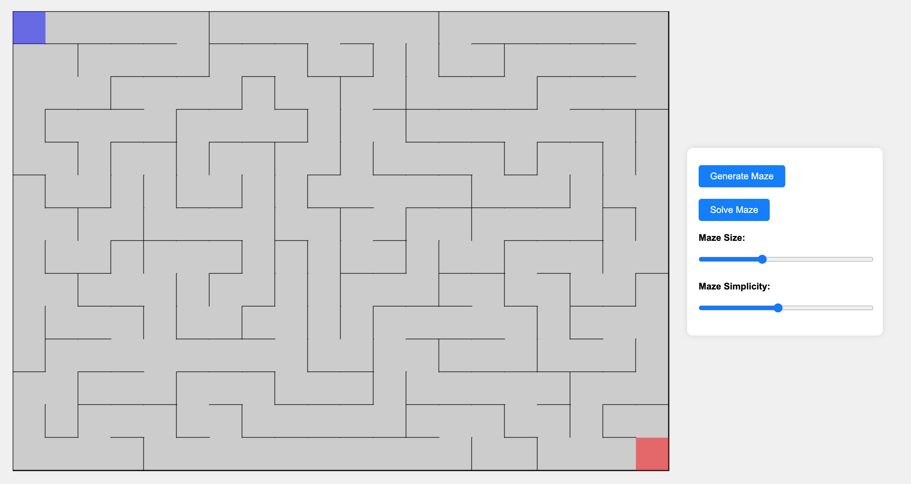

# Maze Generator

A random maze generator with a built-in solver.

## Live Demo

Check out the live demo [here](https://pakkid.github.io/maze-generator/).

## Screenshot

## Controls

- **Generate Maze**: Click the "Generate Maze" button to create a new random maze.
- **Solve Maze**: Click the "Solve Maze" button to see the maze being solved automatically.
- **Maze Size**: Use the slider to adjust the size of the maze.
- **Maze Simplicity**: Use the slider to adjust the simplicity of the maze.
- **Player Movement**: Use the arrow keys or WASD keys to move the player through the maze.

## How It Works

### Maze Generation

The maze is generated using a recursive backtracking algorithm. Here's a brief overview of the process:

1. **Initialization**: The maze is initialized with all walls intact.
2. **Starting Point**: The algorithm starts at a random cell and marks it as visited.
3. **Recursive Backtracking**: The algorithm randomly selects an unvisited neighboring cell, removes the wall between the current cell and the selected cell, and moves to the selected cell. This process is repeated until all cells have been visited.
4. **Extra Paths**: Additional paths are added to increase the simplicity of the maze based on the selected simplicity level.

### Maze Solving

The maze is solved using a depth-first search (DFS) algorithm. Here's a brief overview of the process:

1. **Initialization**: The algorithm starts at the beginning of the maze.
2. **Depth-First Search**: The algorithm explores each path recursively until it reaches the end of the maze.
3. **Path Animation**: The path taken by the algorithm is animated on the canvas.

### Player Movement

The player can navigate through the maze using the arrow keys or WASD keys. The player's movement is restricted by the walls of the maze.

## License

This project is licensed under the MIT License - see the [LICENSE](LICENSE) file for details.